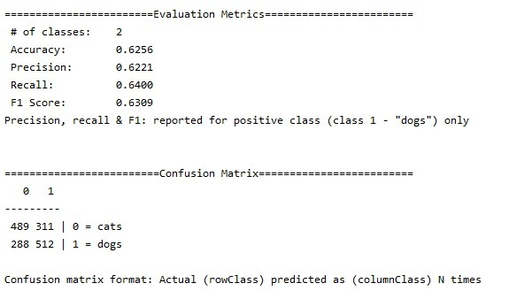
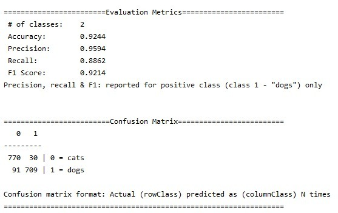

# catsdogsClassifier

Dataset from Kaggle: [Cat and Dog](https://www.kaggle.com/tongpython/cat-and-dog)

1. Model: **cnn_classifier.zip**

   Use simple CNN to train the model

   Result:

   

2. Model: **vgg16_classifier_trainval.zip**

   Use pretrained VGG16 to train the model

   Result:

   
